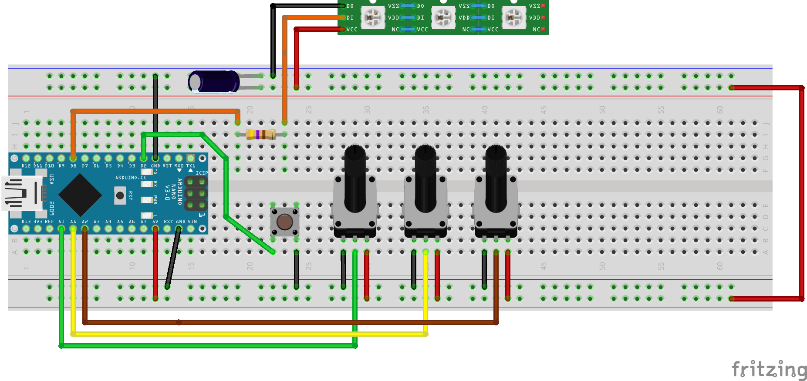

# Fien's lights - NeoPixel LED Effects Controller

A customizable LED light effects controller for Arduino Nano with NeoPixel LED
strips, featuring multiple effects with real-time control via potentiometers and
gamma correction for perceptually smooth brightness transitions.

## Features

This project provides **8 different lighting effects** with intuitive control:

1. **Off** - All LEDs turned off
2. **White Light** - Adjustable color temperature (warm to cool white)
3. **Solid Hue** - Solid color with full hue control
4. **Pulse Hue** - Pulsing/breathing effect in selected color
5. **Chase Hue** - Single LED chasing along the strip
6. **Rainbow Fade** - Rainbow pattern with fade in/out
7. **Fire Effect** - Realistic fire simulation with 6 color palettes (classic,
   hot, toxic, purple, ice, inferno)
8. **White Flicker** - Random white flicker effect (3 LEDs at a time)

## Hardware Requirements

- **Arduino Nano** (or compatible)
- **NeoPixel LED Strip** (WS2812/WS2812B) - 12 LEDs (configurable)
- **3x Potentiometers** (5kΩ or 10kΩ linear)
- **1x Push Button** (tactile switch)
- **1x 470Ω Resistor** (for LED data line protection)
- **1x Electrolytic Capacitor** (6.3V or higher, for power stability)
  - 220µF - 470µF: Suitable for ≤12 LEDs
  - 1000µF: Recommended for larger setups or longer wires
- **Breadboard and jumper wires**
- **Power supply** (5V, adequate for your LED strip)

## Wiring Diagram



### NeoPixel LED Strip

```
Arduino Pin 6 → 470Ω Resistor → LED Strip Data Pin
LED Strip 5V                  → 5V Power Supply
LED Strip GND                 → Common Ground

Capacitor (220µF - 1000µF):
  Positive (+) → LED Strip 5V (near strip input)
  Negative (-) → LED Strip GND (near strip input)
```

_Notes:_

- _The 470Ω resistor protects the LED strip's data input and improves signal
  integrity by reducing reflections._
- _The capacitor (220µF-1000µF, 6.3V or higher) should be placed as close as
  possible to the LED strip's power input. This prevents voltage drops and
  flicker caused by sudden current surges when LEDs turn on. 220µF-470µF is
  sufficient for small setups (≤12 LEDs), while 1000µF is recommended for larger
  installations or longer wire runs._
- _**Important:** Electrolytic capacitors are polarized - connect positive (+)
  to 5V and negative (-) to GND. Reverse polarity can damage the capacitor._

### Potentiometers

```
Brightness Potentiometer (POT 1):
  Left Pin   → GND
  Center Pin → Arduino A0
  Right Pin  → 5V

Hue/Warmth Potentiometer (POT 2):
  Left Pin   → GND
  Center Pin → Arduino A1
  Right Pin  → 5V

Speed Potentiometer (POT 3):
  Left Pin   → GND
  Center Pin → Arduino A2
  Right Pin  → 5V
```

_Note: This wiring gives intuitive left-to-right control (0→1023). You can
reverse GND/5V if you prefer the opposite direction._

### Push Button

```
Button Pin 1 → Arduino Pin 2
Button Pin 2 → GND
```

_Note: The code uses the internal pull-up resistor, so no external resistor is
needed._

### Power

```
Arduino 5V  → 5V Power Supply
Arduino GND → Common Ground
```

**Important:** For LED strips with more than a few LEDs, use an external 5V
power supply (not USB power) to avoid overloading the Arduino.

## Software Setup

### Required Libraries

- **Adafruit NeoPixel** - Install via Arduino Library Manager or PlatformIO

### Installation

1. **Clone or download this repository**

   ```bash
   git clone <repository-url>
   ```

2. **Open in PlatformIO or Arduino IDE**

   - For PlatformIO: Open the project folder
   - For Arduino IDE: Open `src/main.cpp` (rename to `.ino` if needed)

3. **Install dependencies**

   - PlatformIO will auto-install from `platformio.ini`
   - Arduino IDE: Install "Adafruit NeoPixel" library

4. **Configure LED count** (if different from 12)

   - Edit `LED_COUNT` in `main.cpp` (line 6)

5. **Upload to Arduino Nano**

## Controls

### Button Control

- **Single Press**: Cycle through effects (0 → 1 → 2 → 3 → 4 → 5 → 6 → 7 → 0...)
- Effect changes are indicated in the Serial Monitor

### Potentiometer Controls

| Potentiometer  | Pin | Function                                                                                                     |
| -------------- | --- | ------------------------------------------------------------------------------------------------------------ |
| **Brightness** | A0  | Controls overall brightness (0-255) for all effects                                                          |
| **Hue/Warmth** | A1  | Effect-dependent:<br>• White Light: Color temperature (warm to cool)<br>• Other effects: Color hue selection |
| **Speed**      | A2  | Controls animation speed (10-1000ms delay, left = slowest)                                                   |

## Effect Details

### Effect 0: Off

- Turns off all LEDs
- No potentiometer controls active

### Effect 1: White Light

- **Brightness (A0)**: Adjusts light intensity
- **Warmth (A1)**: Color temperature control
  - Low (0): Very warm candlelight (orange glow)
  - Mid (512): Warm white
  - High (1023): Cool daylight (bluish white)
- **Speed (A2)**: Not used
- **8-point color temperature gradient** (5 warm, 3 cool)

### Effect 2: Solid Hue

- **Brightness (A0)**: Adjusts light intensity
- **Hue (A1)**: Full color spectrum selection
- **Speed (A2)**: Not used
- Displays a solid color across all LEDs

### Effect 3: Pulse Hue

- **Brightness (A0)**: Sets maximum brightness for pulse
- **Hue (A1)**: Color selection
- **Speed (A2)**: Pulse speed (breathing rate)
- Smoothly fades in and out

### Effect 4: Chase Hue

- **Brightness (A0)**: LED brightness
- **Hue (A1)**: Color selection
- **Speed (A2)**: Chase speed
- Single LED moves along the strip

### Effect 5: Rainbow Fade

- **Brightness (A0)**: Sets maximum brightness for fade
- **Hue (A1)**: Not used (automatic rainbow)
- **Speed (A2)**: Fade and rotation speed
- Rainbow pattern that rotates and fades

### Effect 6: Fire Effect

- **Brightness (A0)**: Overall fire intensity
- **Hue (A1)**: Selects fire color palette (6 options):
  - **Classic Fire** (pot low): Red → Orange → Yellow (traditional campfire)
  - **Hot Fire**: Orange → Yellow → White (intense heat)
  - **Toxic Fire**: Green → Cyan → Blue (chemical/magical flame)
  - **Purple Fire**: Purple → Magenta → Pink (mystical fire)
  - **Ice Fire**: Blue → Cyan → White (cold flame)
  - **Inferno** (pot high): Dark Red → Red → Orange (deep volcanic fire)
- **Speed (A2)**: Flicker rate (lower = slower flicker, higher = rapid flicker)
- Simulates realistic fire with:
  - Position-based color gradient (bottom LEDs = inner fire color, top LEDs =
    outer flame color)
  - Random brightness flickering (60-100% variation)
  - Occasional deep dimming (30% chance) for dynamic effect

### Effect 7: White Flicker

- **Brightness (A0)**: Flicker intensity
- **Hue (A1)**: Not used (always white)
- **Speed (A2)**: Flicker rate
- Random white flicker (3 LEDs at a time)

## Serial Monitor Debugging

Connect to the Serial Monitor (9600 baud) to see:

- Current effect name when switching
- Real-time potentiometer readings (every 1 second)
- Calculated values (brightness, hue, speed, RGB colors)
- Hardware diagnostics on startup

**Example output:**

```
Button pressed! Switching to effect 1: White Light
[White Light] Brightness pot: 512 -> 128 | Warmth pot: 300 -> RGB(255,198,147)
```

## Configuration

### Adjustable Parameters (in `main.cpp`)

```cpp
#define LED_PIN 6           // NeoPixel data pin
#define LED_COUNT 12        // Number of LEDs in strip
#define BUTTON_PIN 2        // Button pin
#define POT_PIN_BRIGHTNESS A0   // Brightness pot
#define POT_PIN_HUE A1          // Hue/warmth pot
#define POT_PIN_SPEED A2        // Speed pot
```

### Speed Range

- Adjust in `readSpeedFromPot()` function (line 86)
- Default: `map(filtered, 0, 1023, 1000, 10)` (pot left = 1000ms very slow, pot
  right = 10ms fast)
- For overall slower effects: Use higher values (e.g.,
  `map(filtered, 0, 1023, 2000, 50)`)
- For overall faster effects: Use lower values (e.g.,
  `map(filtered, 0, 1023, 500, 5)`)

### Smoothing

- Potentiometer readings use exponential moving average
- Adjust smoothing in helper functions (lines 41, 62, 83)
- Current: `filtered * 7 + raw) / 8`
- More responsive: `filtered * 3 + raw) / 4`
- More stable: `filtered * 15 + raw) / 16`

### Gamma Correction

All effects use gamma correction (gamma=2.6) for perceptually linear brightness
transitions. This provides:

- **Smoother fades**: Pulse and Rainbow effects appear to fade evenly instead of
  changing quickly at low brightness and slowly at high brightness
- **Better color accuracy**: Color ratios remain consistent across all brightness
  levels
- **Realistic fire effect**: Low brightness flickers show better detail with
  realistic "ember glow"
- **Accurate white temperature**: The 8-point color temperature gradient
  maintains accurate warmth appearance at all brightness levels

Gamma correction is applied using `strip.gamma32(color)` in all effect
functions. This compensates for the non-linear relationship between LED power
levels and human brightness perception.

To disable gamma correction, remove or comment out the `strip.gamma32()` calls
in each effect function (see
[solidHue()](src/main.cpp#L233), [pulseHue()](src/main.cpp#L283),
[chaseHue()](src/main.cpp#L344), [rainbowFade()](src/main.cpp#L398),
[fireEffect()](src/main.cpp#L554), [whiteFastFlicker()](src/main.cpp#L590), and
[whiteLight()](src/main.cpp#L196)).

### Porting to Other Arduino-Compatible Boards

This project can be easily ported to other boards (Arduino Uno, ESP32, ESP8266,
etc.):

**Step 1: Adjust pin assignments** in [src/main.cpp](src/main.cpp) (lines 5-14):

- `LED_PIN` - Any PWM-capable digital pin (not actually used for PWM, but good
  practice)
- `BUTTON_PIN` - Any digital pin with interrupt capability recommended
- `POT_PIN_*` - Any analog input pins (A0-A7 on most boards)

**Step 2: Board-specific setup:**

**Using PlatformIO:**

1. Edit `platformio.ini` and change the `board` line:
   ```ini
   [env:uno]
   board = uno  ; or esp32dev, nodemcuv2, etc.
   ```
2. PlatformIO will automatically handle board-specific compilation

**Using Arduino IDE:**

1. Select your board from **Tools → Board**
2. Verify pin assignments are valid for your board (check pinout diagram)
3. Upload as normal

**Important considerations:**

- **Memory**: Boards with less than 2KB SRAM may struggle (Arduino Uno works
  fine)
- **Voltage levels**: ESP boards use 3.3V logic - use level shifter for 5V
  NeoPixels
- **ADC resolution**: ESP32 has 12-bit ADC (0-4095) instead of 10-bit - may need
  to adjust `map()` functions or use `analogReadResolution(10)` on ESP32
- **Pin capabilities**: Not all pins support analog input or pull-up resistors

## Troubleshooting

### Button not working

- Check wiring: One side to Pin 2, other to GND
- Test by shorting Pin 2 to GND manually
- Replace button if faulty
- Check Serial Monitor for button press messages

### Potentiometer values jumping

- **ADC crosstalk**: Code includes dummy reads and settling delays
- **Hardware fixes**:
  - Add 0.1µF capacitor between each analog pin and GND (place close to Arduino
    pins, not at potentiometers)
  - Ensure solid breadboard connections
  - Use shorter wires
  - Check ground connections

### LEDs not responding

- Verify NeoPixel data pin (default: Pin 6)
- Check power supply (5V, sufficient current)
- Ensure common ground between Arduino and LED strip
- Test with simple Adafruit NeoPixel example first

### Colors not changing

- Open Serial Monitor to verify potentiometer readings
- Values should change from 0-1023 when turning pots
- If stuck at 0 or 1023, check wiring (5V, GND, center pin)

## Customization

### Adding New Effects

1. **Increment `NUM_EFFECTS`** (line 17)
2. **Create effect function** following existing patterns
3. **Add case to switch statement** in `loop()` (around line 186)
4. **Add effect name** to button press handler (around line 177)

Example skeleton:

```cpp
void myNewEffect()
{
  // Read potentiometers
  uint8_t brightness = readBrightnessFromPot();
  uint16_t hue = readHueFromPot();
  uint8_t speed = readSpeedFromPot();

  // Your effect logic here

  strip.show();
  delay(speed);
}
```

## More Information

[Adafruit NeoPixel Überguide](https://learn.adafruit.com/adafruit-neopixel-uberguide/neopixel-strips)

## Credits

- Built with Arduino and Adafruit NeoPixel library
- Designed for Arduino Nano with WS2812B LED strips
- I had some help from [Claude Code](https://claude.com/product/claude-code)
  while creating this project.

## License

This project is released into the public domain under the
[Unlicense](https://unlicense.org/).

You are free to use, modify, distribute, and do whatever you want with this
code, with no restrictions or obligations whatsoever. See the [LICENSE](LICENSE)
file for details.

---

**Enjoy your customizable LED effects!** 💡✨
